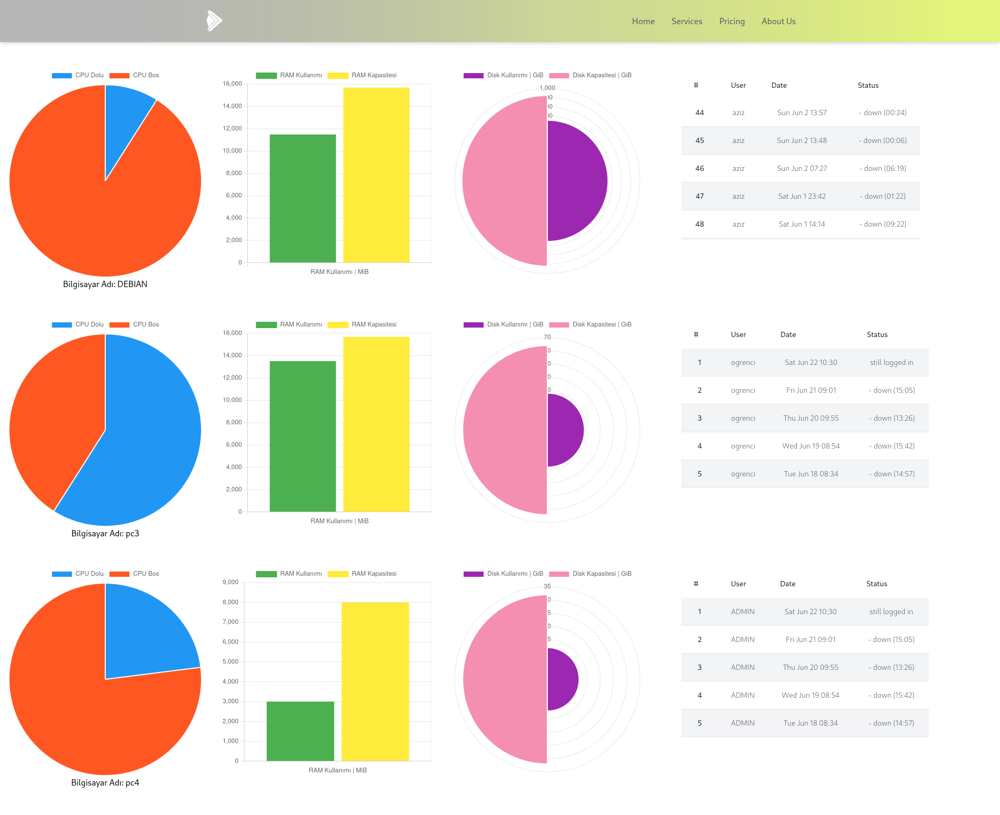

## Clone the repo and go to the repo dir

```bash
git clone https://github.com/AzizEmir/Client-Computer-Monitoring.git
cd Client-Computer-Monitoring
```

## Start the Project

### Backend

```bash
cargo run 
```

### Frontend

```bash
php -S localhost:8000 -t Front-End/
```

## Set up the clients

### Change the IP to the server IP

ClientRequests/post_cpu_ram_disk.sh

```bash
...

curl --request POST \
  --url http://192.168.1.100:9827/cpurequest \
  -H 'Content-Type: application/json' \
  -d "$JSON_DATA"
```
